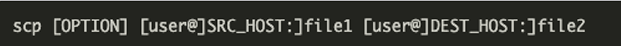

# LogBack

- ConsoleAppender : 콘솔에 log를 출력
- FileAppender : 파일 단위로 log를 저장
- RollingFileAppender : (설정 옵션에 따라) log를 여러 파일로 나누어 저장
- SMTPAppender : log를 메일로 전송하여 기록
- DBAppender: log를 DB에 저장

# SCP(secure copy)
- 어떤 파일을 내보내고자 할때 안전하게내 로컬과 리모트 혹은 리모트와 리모트 간의 로케이션에서 안전하게 전송할 수 잇도록 해주는 command 명령어

1. local -> remote
 - ex) SSL 인증서
2. remote -> local
 - ex) Heap Dump 파일
3. remote -> remote
 - ex) Server Config 파일

### Feature 알아보기
- SSH를 사용하므로 SSH Key 혹은 Password가 필요하다.
- 콜론(“:”)을 사용하여 server location과 directory location을 구분한다.
- SCP 명령어를 사용하기 위해선 Source File에 대한 Read 권한과 Target Server에 Write 권한이 있어야 한다.
- 만약 동일한 File Name + File Path가 Target Server에 존재한다면 경고 없이 Overwrite를 한다.

#### 일반적인상황
- scp file.txt remote_username@1.1.1.1:/remote/directory
#### 파일명을다르게저장
- scp file.txt remote_username@1.1.1.1:/remote/directory/NEW_FILE_NAME.txt
#### 특정 포트로전송
- scp -P 1234 file.txt remote_username@1.1.1.1:/remote/directory
#### Directory 복사 & 전송
scp -r /local/directory remote_username@1.1.1.1:/remote/directory

# CI/CD

### CI(Continuous Integration)
- 자동으로 프로젝트에 코드가 머지된다.

### CD(Continuous Deployment)
- 자동으로 코드가 배포된다 

- 개발을 좀 더 수월하게 하기 위함
- 개발에 좀 더 집중 가능
- 시간 Save (=반복되는 행위를 없애자)